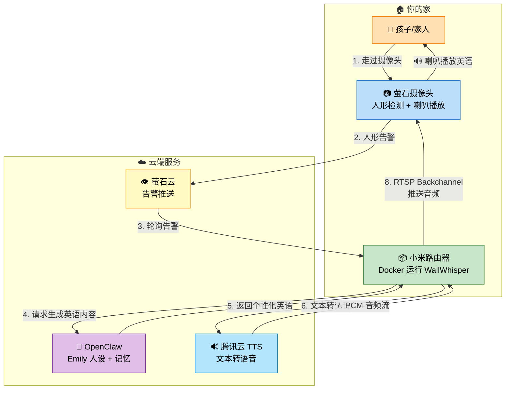

<div align="center">

# 🤫 WallWhisper — 墙上的低语者

### 用家里已有的摄像头和路由器，零成本打造 AI 英语私教

**OpenClaw × 萤石摄像头 × 小米路由器 = 孩子一走过，英语自动说**

[](LICENSE)
[](https://www.python.org/)
[](Dockerfile)

[English](README_EN.md) | 简体中文

</div>

---

## ✨ 这是什么？

> *女儿从幼儿园回来，走进客厅——*
>
> *墙上的摄像头悄悄亮了一下。*
>
> *"Hello! Cat! Can you say cat? Meow!"*
>
> *女儿咯咯笑："Cat! 喵喵！"*
>
> *这就是 WallWhisper——墙上的低语者，住在摄像头里的英语小姐姐 Emily。*

**WallWhisper** 是一个开源的家庭英语智能教学系统。核心角色 **Emily**（英语小姐姐）通过萤石摄像头感知家人出现，自动生成个性化英语内容，并通过摄像头喇叭播放。

不需要额外硬件，不需要打开 App，不需要刻意"上课"——**孩子只要在家走动，英语学习就自然发生。**

## 🔥 为什么做这个？

### 💡 核心理念：语言学习需要的是环境，不是主动性

作为一个程序员爸爸，我一直在想怎么让 3 岁的女儿自然地接触英语。**语言学习最关键的不是教材多好、老师多牛，而是有没有一个持续的语言环境。**

然而，市面上所有的英语学习工具都有同一个致命问题——**它们都需要孩子"走入"**：

| 方式 | 问题 |
|------|------|
| 📱 手机/平板 App | 需要孩子主动打开，3 岁孩子不会操作 |
| 📺 英语动画/节目 | 需要主动调台、选片，而且容易沉迷屏幕 |
| 📚 英语绘本 | 需要家长陪读，时间精力有限 |
| 👩‍🏫 线下外教课 | 一周两次，课间全忘，一年还要 2 万+ |
| 🤖 AI 对话产品 | 需要孩子坐在屏幕前主动互动 |

**这些都在考验孩子的"学习主动性"。但对一个 3 岁小朋友来说，主动性本身就是奢望。**

所以我换了个思路：**与其让孩子走向英语，不如让英语走向孩子。**

### 🏠 让家里长出一个"墙上的低语者"

打造英语环境，没有什么比**家里有一个隐藏式的英语外教**更好了。问题是，谁来当这个外教？

答案就在你家的墙上——你的摄像头。这就是 **WallWhisper** 这个名字的由来：**墙壁上的低语者**。

**📷 摄像头是天然的最佳载体：**
- 🫥 **不突兀** — 它本身就在你家的墙上/天花板上，孩子早已习惯它的存在
- 👀 **视角宽广** — 比手机、平板更容易捕捉到孩子的活动轨迹
- 🔊 **自带喇叭** — 不需要额外的蓝牙音箱，一个设备搞定感知 + 播放
- 🧒 **无需操作** — 孩子不用按任何按钮，走过就触发，真正零交互

**🧠 OpenClaw 让 Emily 有了灵魂：**

传统的英语播放器只能机械式地重复预录音频。但 Emily 不一样——基于 [OpenClaw](https://openclaw.com) 开源 AI Agent 平台，Emily 拥有完整的**人设、记忆和成长体系**：

- 她知道你孩子叫什么、几岁、喜欢什么
- 她记得上周教过哪些单词，今天该复习什么
- 她会根据孩子的水平逐步提高难度
- **她会伴随孩子一起成长**，而不是永远停留在 "Hello, how are you?"

**📦 小米路由器是天然的容身之所：**

Emily 需要一个 24 小时在线的"家"来运行。与其买一台新的服务器或树莓派，不如看看你家已有的——**小米路由器**：

- 🔌 它本来就 24 小时开着，不增加电费
- 🌐 它本来就是家庭网关，局域网访问摄像头零延迟
- 🐳 支持 Docker 的小米路由器（7000/BE 系列）直接运行 WallWhisper 容器
- 💰 **零新增硬件成本**，经济又高效

> **总结一下：摄像头感知孩子 + OpenClaw 生成个性化英语 + 路由器 24h 运行 = WallWhisper，墙上的低语者。全部复用已有设备，新增成本为零。**

## 🎯 核心亮点

| 🏠 沉浸式英语环境 | 🧠 OpenClaw 伴随成长 | 🔊 摄像头喇叭直出 | 💰 零额外硬件成本 |
|:---:|:---:|:---:|:---:|
| 不需要孩子主动"打开"任何东西，走过就触发，英语自己找上门 | Emily"认识"你的家人，记住教过的单词，根据进度调整难度 | RTSP Backchannel 黑科技，音频直接推到摄像头喇叭，无需额外音箱 | 摄像头 + 路由器 + AI API，全部复用家里已有设备 |

## 🏗️ 系统架构



**整个流程在 10 秒内完成：** 检测到人 → AI 生成内容 → TTS 合成语音 → 摄像头喇叭播放 🎉

## 🎬 三种交互模式

| 模式 | 触发条件 | 内容 | 示例 |
|:---:|:---:|:---:|:---|
| 🚶 **pass_by** | 有人路过摄像头 | 简短打招呼 + 一个单词 | *"Hello! Cat! Can you say cat? Meow!"* |
| 🧑‍🏫 **interact** | 短时间多次触发 | 深度互动教学 | *"Hi! Look, a dog! Woof woof! Can you say dog?"* |
| ⏰ **scheduled** | 定时任务 | 晨播/睡前故事/每日复习 | *"Good morning! Let's learn a color today! Red!"* |

每段英语后自动附带中文解释（中英双语），确保孩子能理解：

> *Hello! Cat! Can you say cat? Meow!*
> *---*
> *你好！Cat是小猫咪！你能说cat吗？喵！*

## 📹 效果演示

<!-- TODO: 添加效果视频/GIF -->
<!-- 建议拍摄：孩子走过摄像头 → Emily 自动说英语 → 孩子开心回应 -->

> 📌 效果视频制作中，敬请期待...

## 🚀 快速开始

### 方式一：本地运行（开发/测试）

```bash
# 1. 克隆项目
git clone https://github.com/treychen-369/WallWhisper.git
cd WallWhisper

# 2. 安装依赖
pip install -r requirements.txt

# 3. 配置
cp config.example.yaml config.yaml
# 编辑 config.yaml，填入你的 API 密钥

# 4. 测试 TTS
python run.py test_tts "Hello! Can you say cat?"

# 5. 运行 Emily
python run.py emily
```

### 方式二：Docker 部署（推荐用于路由器/服务器）

```bash
# 1. 构建镜像
docker-compose up -d --build

# 2. 或者使用预构建镜像
IMAGE=your-registry/wallwhisper:latest docker-compose up -d
```

### 方式三：小米路由器部署（极客玩法 🔧）

> 如果你的小米路由器支持 Docker（如小米 7000/BE系列），可以直接在路由器上运行 WallWhisper，实现真正的"无服务器"部署。

详细步骤请参考 [部署指南](docs/deployment-guide.md)。

## ⚙️ 配置说明

核心配置项（`config.yaml`）：

| 配置项 | 说明 | 必填 |
|--------|------|:---:|
| `ai.api_key` | DeepSeek API 密钥 | ✅ |
| `tts.secret_id` / `tts.secret_key` | 腾讯云 TTS 密钥 | ✅ |
| `ezviz.app_key` / `ezviz.app_secret` | 萤石开放平台密钥 | ✅ |
| `openclaw_emily.api_url` / `api_token` | OpenClaw Emily API（可选） | ⬜ |
| `camera_speaker.cam_ip` / `cam_password` | 摄像头喇叭推送 | ⬜ |

> 💡 不使用 OpenClaw 也可以运行！Emily 会直接调用 DeepSeek API 生成内容。OpenClaw 提供的是统一人设和长期记忆能力。

## 🧠 OpenClaw 人设（可选但推荐）

[OpenClaw](https://openclaw.com) 是一个开源 AI Agent 平台，Emily 基于它构建了完整的人设和记忆系统：

- **SOUL.md** — Emily 的人格设定（温柔、耐心、爱玩）
- **USER.md** — 你的家庭信息（孩子年龄、兴趣爱好）
- **MEMORY.md** — 教学记忆（教过哪些单词、孩子的进步）

配置模板在 `examples/openclaw-config/` 目录，详细设置请参考 [OpenClaw 配置指南](docs/openclaw-setup.md)。

## 🔊 RTSP Backchannel：摄像头喇叭黑科技

WallWhisper 最酷的功能之一是**直接通过摄像头喇叭播放英语**，无需任何额外音箱！

技术原理：
- 萤石 C7 摄像头支持 RTSP Backchannel（反向音频通道）
- Emily 通过 TCP 连接将 AAC 音频流推送到摄像头
- 摄像头的内置喇叭直接播放

> 📌 目前已验证萤石 C7 系列摄像头，其他支持 RTSP Backchannel 的摄像头理论上也可以适配。

## 📁 项目结构

```
WallWhisper/
├── run.py                  # 统一启动器
├── config_loader.py        # 配置加载与校验
├── emily_v2.py             # V2 主引擎（摄像头联动 + 多模式）
├── emily.py                # V1 旧版（保留兼容）
├── ezviz_monitor.py        # 萤石告警轮询 + Token 管理
├── tts_stream.py           # 腾讯云 WebSocket 流式 TTS
├── camera_speaker.py       # RTSP Backchannel 摄像头喇叭
├── camera_mic.py           # 摄像头麦克风输入
├── asr_engine.py           # 语音识别
├── conversation.py         # 多轮对话引擎
├── config.example.yaml     # 配置模板
├── deploy.sh               # 路由器部署脚本（7步安全流程）
├── sync_openclaw.py        # OpenClaw 人设同步工具
├── sync_router.py          # 路由器配置同步工具
├── Dockerfile              # Docker 构建（ARM64 + x86_64）
├── docker-compose.yml      # Docker Compose 部署
├── examples/
│   └── openclaw-config/    # OpenClaw 人设配置模板
└── docs/
    ├── architecture.md     # 详细架构说明
    ├── deployment-guide.md # 部署指南
    ├── openclaw-setup.md   # OpenClaw 配置指南
    └── video-script.md     # 效果视频拍摄脚本
```

## 🛠️ 技术栈

| 层级 | 技术 | 用途 |
|------|------|------|
| 🧠 AI | **DeepSeek API** / **OpenClaw** | 个性化英语内容生成 |
| 🔊 语音 | **腾讯云 WebSocket TTS** | 实时文本转语音 (voice_type: 101009 英文女声) |
| 👁️ 感知 | **萤石开放平台 API** | 人形检测告警轮询 |
| 📡 播放 | **RTSP Backchannel** / **PyAudio** | 摄像头喇叭或本地播放 |
| 🐳 部署 | **Docker** + **docker-compose** | ARM64 适配路由器 |

## 🗺️ Roadmap

- [x] 人形检测自动触发
- [x] 中英双语输出
- [x] RTSP Backchannel 摄像头喇叭
- [x] OpenClaw 人设 + 记忆
- [x] 多轮对话（ASR 语音识别 + AI 回复）
- [ ] 支持更多 TTS 服务（Azure、Google、Edge TTS）
- [ ] 支持更多摄像头品牌（海康、大华）
- [ ] Web 管理面板
- [ ] 教学进度可视化报告
- [ ] 多语言支持（日语、法语等）

## 🤝 贡献

欢迎提交 Issue 和 Pull Request！详见 [贡献指南](CONTRIBUTING.md)。

## 📄 License

[MIT License](LICENSE) — 自由使用、修改、分发。

## 💖 致谢

- [OpenClaw](https://openclaw.com) — 开源 AI Agent 平台，让 Emily 有了"灵魂"
- [DeepSeek](https://deepseek.com) — 强大且实惠的 AI 大模型
- [腾讯云 TTS](https://cloud.tencent.com/product/tts) — 高质量中英文语音合成
- [萤石开放平台](https://open.ys7.com) — 摄像头 API 和告警服务

---

<div align="center">

**如果 WallWhisper 帮到了你的家庭，请给个 ⭐ Star 支持一下！**

*Made with ❤️ by a programmer dad who wants his daughter to love English.*

*WallWhisper — 墙上的低语者，让英语像空气一样包围你的孩子。*

</div>
